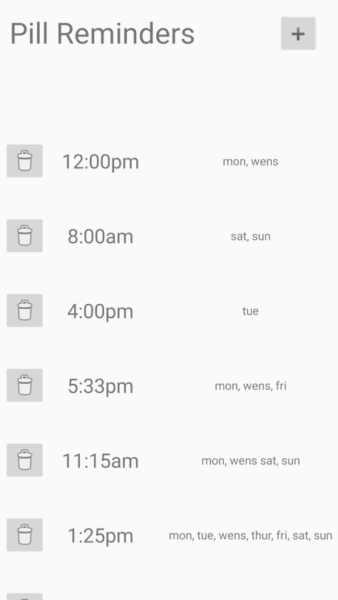
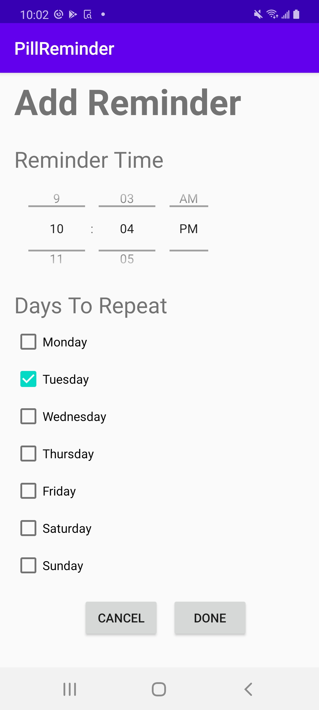

# General Info

All code is in PillReminder/app/src/main/java/com/example/pillreminder/
It is well documented using kdoc style commenting and clearly displayed encapsulation and abstraction. 
Complex logic is abstracted away by classes such as the DataHandler class. 
In addition, all methods and instance variables that can be made private are made private.

# Specific info about each kotlin class

# UI 
All UI xml files are in PillReminder/app/src/main/res/

Here is a screenshot of the screen you see when in the main activity:

Here is a screenshot of the screen you see when you click on the plus button:

# Functionality
As this app is meant to be a demo some functionality is missing. The app does not create notifications and UI may not scale properly since I only 
have one test device. 

